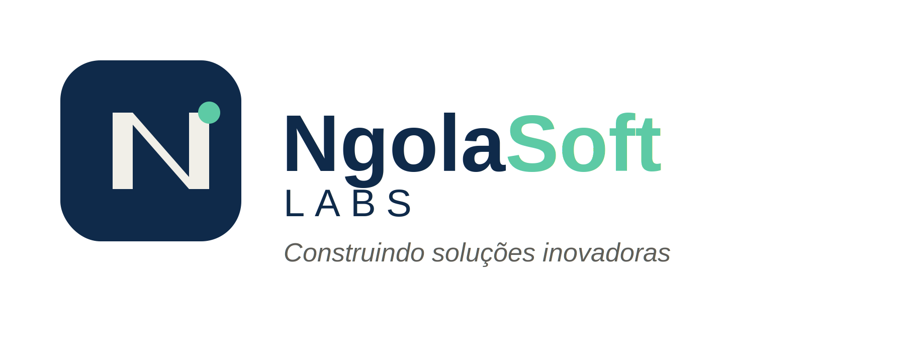
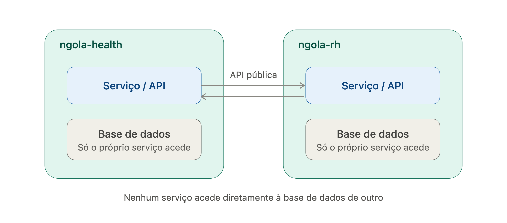

  

  Estúdio pessoal de desenvolvimento de software, criado com fins de aprendizagem.

---

## Sobre

**NgolaSoft Labs** é um pequeno estúdio de estudo e prática em desenvolvimento de software. Aqui reúno sistemas desenvolvidos a partir de auditorias e estudos próprios, com o objetivo de aprofundar arquitetura, boas práticas e novas tecnologias — servindo também como portfólio público.

Cada sistema segue a convenção de nome `ngola-<domínio>` (ex: `ngola-health`, `ngola-shop`), mantendo uma estrutura e princípios de arquitetura consistentes entre projetos.

## Projetos

| Sistema | Descrição | Estado |
|---|---|---|
| [`ngola-health`](./ngola-health) | Sistema de gestão de saúde | 🚧 Em desenvolvimento |

> Novos sistemas serão adicionados a esta tabela à medida que forem criados.

## Princípios de arquitetura

- Cada sistema tem a sua própria base de dados — sem partilha direta entre projetos
- Comunicação entre sistemas, quando necessária, é feita via API pública

  

## Autor

Desenvolvido e mantido por Anisio Munda, como parte da minha jornada de aprendizagem em engenharia de software.

---

NgolaSoft Labs © 2026
